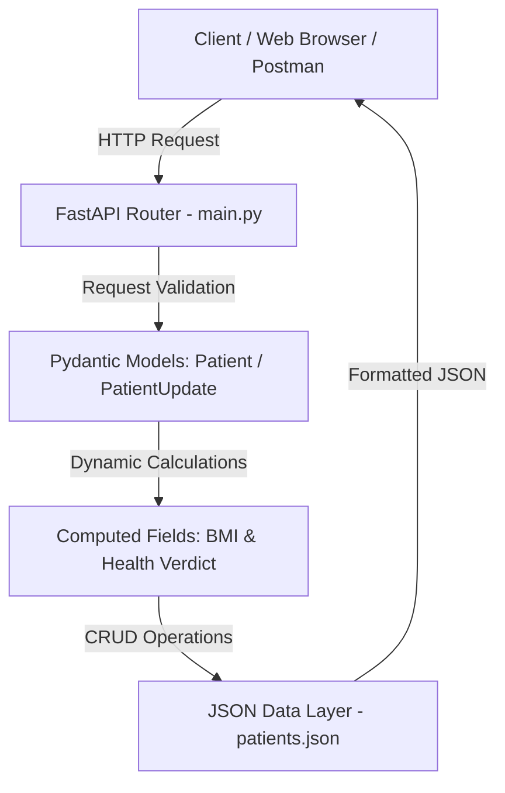
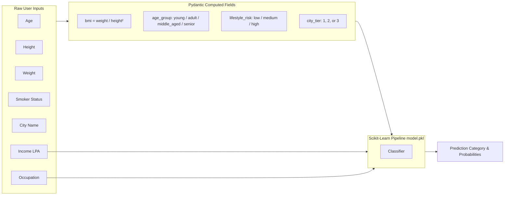

# Python Backend, FastAPI & Machine Learning Suite 🚀

[](https://www.python.org/)
[](https://fastapi.tiangolo.com/)
[](https://docs.pydantic.dev/)
[](https://streamlit.io/)
[](https://scikit-learn.org/)

A production-ready repository showcasing modern Python backend development, robust data validation using **Pydantic v2**, high-performance REST APIs built with **FastAPI**, and an end-to-end **Machine Learning pipeline** integrated with a **Streamlit** user interface.

---

## 📑 Table of Contents

- [📁 Repository Architecture](#-repository-architecture)
- [⚡ Quick Start & Installation](#-quick-start--installation)
- [🏥 Section 1: Patient Management System API](#-section-1-patient-management-system-api)
  - [Architecture & Data Flow](#architecture--data-flow)
  - [API Endpoints Reference](#api-endpoints-reference)
  - [Example Payloads](#example-payloads)
  - [Running the Patient API](#running-the-patient-api)
- [🤖 Section 2: ML Insurance Premium Predictor](#-section-2-ml-insurance-premium-predictor)
  - [Model Pipeline & Feature Engineering](#model-pipeline--feature-engineering)
  - [Prediction API Specification](#prediction-api-specification)
  - [Streamlit Web Interface](#streamlit-web-interface)
  - [Running the ML System](#running-the-ml-system)
- [🧩 Section 3: Pydantic v2 Mastery Series](#-section-3-pydantic-v2-mastery-series)
  - [Lesson 01: Why Pydantic & Basic Constraints](#01-why-pydantic-and-basic-constraints)
  - [Lesson 02: Field Validators](#02-field-validators)
  - [Lesson 03: Model Validators](#03-model-validators)
  - [Lesson 04: Computed Fields](#04-computed-fields)
  - [Lesson 05: Nested Models](#05-nested-models)
  - [Lesson 06: Serialization & Model Export](#06-serialization--model-export)
- [🛠️ Quick Reference Cheat Sheet](#️-quick-reference-cheat-sheet)

---

## 📁 Repository Architecture

```text
Backend-Python/
│
├── main.py                   # Patient Management System (FastAPI CRUD REST API)
├── patients.json             # Persistent JSON datastore for Patient records
│
├── app.py                    # Insurance Premium Classifier API (FastAPI ML Inference)
├── frontend.py               # Interactive Streamlit UI for Insurance Predictions
├── model.pkl                 # Pre-trained Scikit-Learn Classification Pipeline
├── insurance.csv             # Raw dataset used for ML model training
├── fastapi_ml_model.ipynb    # Jupyter Notebook: EDA, feature engineering & model training
│
├── Pydantic/                 # Pydantic v2 deep-dive modules
│   ├── 01_pydantic_why.py       # Motivation, typing, and Field constraints
│   ├── 02_field_validator.py    # Custom @field_validator logic
│   ├── 03_model_validator.py    # Cross-field validations with @model_validator
│   ├── 04_computed_field.py     # Real-time @computed_field attributes
│   ├── 05_nested_model.py       # Hierarchical schemas (nested BaseModel)
│   └── 06_serialization.py      # .model_dump() and .model_dump_json() operations
│
├── requirements.txt          # Python dependencies & libraries
└── README.md                 # Project documentation
```

---

## ⚡ Quick Start & Installation

### 1. Clone the Repository & Navigate

```bash
git clone https://github.com/mohd-ahtasham-ansari/Backend-Python.git
cd Backend-Python
```

### 2. Create and Activate Virtual Environment

**Windows (PowerShell / Command Prompt):**
```powershell
python -m venv myvenv
.\myvenv\Scripts\activate
```

**macOS / Linux:**
```bash
python3 -m venv myvenv
source myvenv/bin/activate
```

### 3. Install Dependencies

```bash
pip install --upgrade pip
pip install -r requirements.txt
```

---

# 🏥 Section 1: Patient Management System API

The **Patient Management System** (`main.py`) provides full **CRUD** (Create, Read, Update, Delete) capabilities over a persistent JSON database (`patients.json`), featuring automatic BMI calculation, dynamic health verdicts, and multi-parameter record sorting.

### Architecture & Data Flow



### Key Data Validation Rules

- **`Patient` Model**:
  - `id`: Non-empty string identifier (e.g. `"P001"`).
  - `name`: Full patient name.
  - `city`: City of residence.
  - `age`: Positive integer strictly bounded by `gt=0, lt=120`.
  - `gender`: Strictly validated against `Literal['Male', 'Female', 'Other', 'male', 'female', 'other']`.
  - `height`: Positive float in meters (e.g., `1.75`).
  - `weight`: Positive float in kilograms (e.g., `70.0`).
- **Dynamic `@computed_field` Attributes**:
  - `bmi`: Calculated as $\text{weight} / (\text{height}^2)$, rounded to 2 decimal places.
  - `verdict`: Evaluated in real time:
    - `Underweight`: $\text{BMI} < 18.5$
    - `Normal`: $18.5 \le \text{BMI} < 24.9$
    - `Overweight`: $25 \le \text{BMI} < 29.9$
    - `Obese`: $\text{BMI} \ge 30$
- **Partial Update (`PatientUpdate`)**: Allows patching selective attributes (`exclude_unset=True`) while automatically triggering recalculation of BMI and verdict.

---

### API Endpoints Reference

| Method | Endpoint | Description | Query / Path Parameters | Success Response |
| :--- | :--- | :--- | :--- | :--- |
| `GET` | `/` | Root Healthcheck | None | `{"message": "hello world"}` |
| `GET` | `/about` | Platform Information | None | `{"message": "campusX is an education platform..."}` |
| `GET` | `/view` | Retrieve all patients | None | Full dictionary of patient records |
| `GET` | `/patient/{patient_id}` | Fetch patient by ID | `patient_id` (e.g. `P001`) | Patient object or `404 Not Found` |
| `GET` | `/sort` | Sort patient records | `sort_by` (`height` \| `weight` \| `bmi`), `order` (`asc` \| `desc`) | Array of sorted patient records |
| `POST` | `/create` | Register a new patient | Body: `Patient` model JSON | `201 Created` |
| `PUT` | `/edit/{patient_id}` | Update existing record | `patient_id`, Body: `PatientUpdate` JSON | `200 OK` |
| `DELETE` | `/delete/{patient_id}` | Remove patient record | `patient_id` | `200 OK` |

---

### Example Payloads

#### Create Patient (`POST /create`)

**Request:**
```json
{
  "id": "P008",
  "name": "Sarah Connor",
  "city": "Mumbai",
  "age": 29,
  "gender": "Female",
  "height": 1.65,
  "weight": 58.0
}
```

**Stored Record with Computed Fields:**
```json
{
  "name": "Sarah Connor",
  "city": "Mumbai",
  "age": 29,
  "gender": "Female",
  "height": 1.65,
  "weight": 58.0,
  "bmi": 21.3,
  "verdict": "Normal"
}
```

#### Sort Patients (`GET /sort?sort_by=bmi&order=desc`)

Sorts all registered patients from highest to lowest BMI index.

---

### Running the Patient API

```bash
uvicorn main:app --reload --port 8000
```

- **Interactive Swagger Docs**: [http://127.0.0.1:8000/docs](http://127.0.0.1:8000/docs)
- **ReDoc Documentation**: [http://127.0.0.1:8000/redoc](http://127.0.0.1:8000/redoc)

---

# 🤖 Section 2: ML Insurance Premium Predictor

An end-to-end Machine Learning deployment consisting of a FastAPI inference engine (`app.py`), a Scikit-Learn classification model (`model.pkl`), and a modern Streamlit frontend (`frontend.py`).

### Model Pipeline & Feature Engineering

The FastAPI backend uses **Pydantic computed fields** to transform raw user inputs into derived ML features prior to passing them into the Scikit-Learn pipeline:



- **`bmi`**: $\text{weight} / (\text{height}^2)$
- **`lifestyle_risk`**:
  - `high`: Smoker and $\text{BMI} > 30$
  - `medium`: Smoker or $\text{BMI} > 27$
  - `low`: Non-smoker with $\text{BMI} \le 27$
- **`age_group`**: `<25` (young), `<45` (adult), `<60` (middle_aged), `60+` (senior).
- **`city_tier`**: Automatically resolves Indian cities into Tier 1 (Metros), Tier 2, or Tier 3.

---

### Prediction API Specification

#### Endpoint: `POST /predict`

**Request Body (`UserInput`):**
```json
{
  "age": 35,
  "weight": 75.0,
  "height": 1.75,
  "income_lpa": 12.5,
  "smoker": false,
  "city": "Bangalore",
  "occupation": "private_job"
}
```

**Response Body (`200 OK`):**
```json
{
  "predicted_category": "Medium",
  "confidence": 0.8425,
  "class_probabilities": {
    "High": 0.0512,
    "Medium": 0.8425,
    "Low": 0.1063
  },
  "response": {
    "predicted_category": "Medium",
    "confidence": 0.8425,
    "class_probabilities": {
      "High": 0.0512,
      "Medium": 0.8425,
      "Low": 0.1063
    }
  }
}
```

---

### Streamlit Web Interface

The frontend (`frontend.py`) offers a user-friendly UI to interact with the ML model without touching raw JSON:

1. Sliders & input boxes for numerical values (Age, Height, Weight, Income).
2. Selectboxes for Smoker status, Indian Cities, and Occupations.
3. Live cards displaying predicted category, confidence score, and interactive probability breakdown.

---

### Running the ML System

1. **Launch the FastAPI Prediction Server**:
   ```bash
   uvicorn app:app --reload --port 8000
   ```

2. **Launch the Streamlit Web Application** (in a new terminal):
   ```bash
   streamlit run frontend.py
   ```

3. Open your browser and navigate to: **[http://localhost:8501](http://localhost:8501)**

---

# 🧩 Section 3: Pydantic v2 Mastery Series

The `Pydantic/` directory contains complete, standalone tutorial scripts demonstrating modern Pydantic v2 patterns and features.

### 01. Why Pydantic and Basic Constraints
📁 `Pydantic/01_pydantic_why.py`
- Contrasts error-prone manual `if/else` validation vs declarative `BaseModel` schemas.
- Demonstrates `Annotated`, `Field(gt=0, strict=True)`, `EmailStr`, `AnyUrl`, and `Optional[List[str]]`.
- Shows how to add metadata like `title` and `description` for auto-generated OpenAPI documentation.

### 02. Field Validators
📁 `Pydantic/02_field_validator.py`
- Demonstrates `@field_validator` with classmethod definitions.
- Validates corporate domain emails (e.g. ensuring emails end in `@hdfc.com` or `@icici.com`).
- Uses `mode="after"` transformation to auto-format strings into `.title()` casing.

### 03. Model Validators
📁 `Pydantic/03_model_validator.py`
- Explains cross-field validation with `@model_validator(mode='after')`.
- Enforces conditional business rules across multiple fields (e.g. requiring an emergency contact phone in `contact_details` if `age > 60`).

### 04. Computed Fields
📁 `Pydantic/04_computed_field.py`
- Explains `@computed_field` with `@property` decorators.
- Dynamically derives attributes at serialization time (such as calculating `bmi` from `height` and `weight`) without requiring client input.

### 05. Nested Models
📁 `Pydantic/05_nested_model.py`
- Structures complex domain entities by nesting child models (`Address`) inside parent models (`Patient`).
- Demonstrates clean parsing and composition of nested dictionary inputs.

### 06. Serialization & Model Export
📁 `Pydantic/06_serialization.py`
- Explains Pydantic v2 export APIs:
  - `model.model_dump()`: Converts model instances into Python native dictionaries.
  - `model.model_dump_json()`: Serializes model instances directly into JSON strings.
  - Selective serialization using `exclude={"address": ["state"]}` or `exclude_unset=True`.

---

## 🛠️ Quick Reference Cheat Sheet

| Task | Command | Default Port / URL |
| :--- | :--- | :--- |
| **Run Patient API** | `uvicorn main:app --reload --port 8000` | [http://127.0.0.1:8000/docs](http://127.0.0.1:8000/docs) |
| **Run ML Prediction API** | `uvicorn app:app --reload --port 8000` | [http://127.0.0.1:8000/docs](http://127.0.0.1:8000/docs) |
| **Run Streamlit Frontend** | `streamlit run frontend.py` | [http://localhost:8501](http://localhost:8501) |
| **Run Pydantic Script** | `python Pydantic/01_pydantic_why.py` | Terminal stdout |
| **Inspect Model Training** | `jupyter notebook fastapi_ml_model.ipynb` | Jupyter Interface |

---

## 👨‍💻 Contributing & License

Feel free to submit pull requests or open issues for feature improvements, additional Pydantic patterns, or new ML architectures!
Distributed under the MIT License.
